    

<h1 style: align=center> Cinemana: System Architecture </h1>

 Modern Software Architecture 

Al Hassani Baraa Basim Raoof 2022272110002   Kazi Enamul Hque 2022272110004     Pant Sushovan Nath 2022272110006   Muhammad Zarar 2022272110007  

---

| Date       | Member                | Contribution                        |
| ---------- | --------------------- | ----------------------------------- |
| 30/03/2023 | Sushovan              | Initial comit to github.            |
| 03/04/2023 | All                   | Updated the key quality attributes. |
| 06/04/2023 | Sushovan, Baraa, Kazi | Finished three quality attributes.  |
| 09/14/2023 | Kazi, Baraa, Sushovan | Discussion for further changes. |
| 14/04/2023 | Sushovan              | Added "System Context".            |
| 19/04/2023 | Baraa, Sushovan       | Added some database diagrams.                 |
| 25/04/2023 | Kazi       | Process diagram.                |
| 26/04/2023 | Baraa       | Use case diagram and scenario update. |
| 28/04/2023 |  Sushovan       | Refined the Requirements section.                 |
| 01/05/2023 | Baraa, Sushovan       | Reviewed the whole document.                 |
| 05/05/2023 | All       | First draft presentation.                 |
| 09/05/2023 | All       | Revised the whole document.                 |
| 11/05/2023 | Sushovan       | Final revision.                 |
---

## Contents

- [System Context](#1-system-context)
  - [Context](#11-context)
  - [Description](#12-description)
- [Business Information](#2-business-information)
  - [Business Vision](#21-business-vision)
  - [Target Audience](#22-target-audience)
  - [System Evolution](#23-system-evolution)
- [Requirements](#3-requirements)
  - [Architectural Vision](#31-architectural-vision)
  - [Stakeholders](#32-stakeholders)
  - [Quality Attributes](#33-quality-attributes)
  - [Key Quality Concerns](#34-key-quality-concerns)
  - [Stories and Use cases](#35-stories-and-use-cases)
  - [Process diagram](#36-process-diagram)
- [Database and Cloud](#4-database-and-cloud)
  - [Database Schema](#41-database-schema)
  - [Database Pipelines](#42-database-pipelines)
  - [Cloud Architecture](#44-cloud-architecture)
- [Analysis](#5-analysis)
  - [Assumptions](#51-assumptions)
  - [Key Business Metrics](#52-key-business-metrics)
  - [High-level-design-decisions](#53-high-level-design-decisions)
- [References](#references)

## 1. System Context

This section outlines the system context. The section starts with an introduction of the company. Subsequently, the context of the system is outlined. This section ends with a description about the Cinemana software.

### 1.1 Context

In today’s world, with the easy access to internet and computer devices, the potential of video streaming services are limitless. The growing online population have defined new changes in the way videos and movies are consumed by the public. Not only do people have the freedom to watch anything they want from their personal devices but also no longer need to go to a shop or a movie theatre to rent or watch a movie. This even provides them with the choice to enjoy movies or videos regardless of the time of release and also at their own pace. With such trends and changes, we foresaw a good opportunity to fill that demand and Cinemana was born.

### 1.2 Description

Cinemana is a subscription-based streaming service that allows its members to watch TV shows and movies on an internet-connected device. Cinemana allows its users to easily navigate through a number of movies and TV shows effortlessly and also provides a search bar functionality. Users will be able to stream the content online or download it directly to the device. It is equipped with user-tailored recommendation system which is backed by a large database of movies. It is available in different languages and also provides its users with the flexibility to synchronize different devices under the same account. It also allows the users to add movies to a “watch-later” list and also group movies together.

## 2. Business Information

The following section emphasizes on describing the business environment of Cinemana. The architectural relevant business information is also illustrated.
At first the business vision and rationale are presented, including the unique selling point of Cinemana. Furthermore, the main functionalities of the system are described with an emphasize on providing high-level overview of the system.
Afterwards, the evolution and roadmap of Cinemana are presented.
 The section finishes with an illustration of the financial model and an identification of potential competitors.

### 2.1 Business Vision

Our vision statement is, “Becoming the best global entertainment distribution service.” Cinemana will change the way entertainment videos are consumed by the public and to some extent even the way they are produced. Cinemana 	stresses the desire to set a quality bar in the provision of on-demand video services. The ability of our members to control what they want to watch, when they want it, in one simple subscription is a great experience for each user.
Cinemana has three main goals:

1. Provide its users with a stellar service.
2. Provide investors a prospect of sustained profitable growth.
3. Provide employees the allure of huge impact.

The opportunities and threats are listed in the table below.

| Opportunities              | Threats                                               |
| -------------------------- | ----------------------------------------------------- |
| 1. Exponential growth.     | 1. Limited copyrights.                                |
| 2. Global costumer base.   | 2. Growing operational costs.                         |
| 3. Affordable pricing.     | 3. Competitors could provide better local services。 |
| 4. Adaptability.           | 4. Government regulations.                            |
| 5. Exploit Ad-based model. | 5. Piracy and carbon emission.                        |

### 2.2 Target audience

The target customer of Cinemana is any individual with the knowledge to operate a simple computer and has an internet connection. The target audience can be of any age group as the system will provide content relevant to people of all ages. The customer must be familiar with using the internet and have the basic ability to browse through a site. The target audience should be willing to spend a small amount of money for monthly subscription.

### 2.3 System Evolution

As soon as Cinemana is widely accepted by users in the target audience, the next step involves making Cinemana’s presence global by penetrating foreign markets.
 Furthermore, the goal is to develop a highly efficient and user friendly on-demand video streaming service that can be used across various devices under different kinds of internet speed. Hence, the system will be implemented to more devices (iOS and Android) and also be optimized to adjust video settings according to the available internet connection speed.
 Additionally, with the increment of the supported devices, new versions of Cinemana will provide the users with better features backed up with AI.

## 3. Requirements
In this section, the requirements of the Cinemana are outlined. It starts with the architectural vision of the system, followed by the stakeholders and their concerns. Subsequently, the key drivers are presented, which are derived from the concerns of the stakeholders.

### 3.1 Architectural Vision
 <figure align="center">
  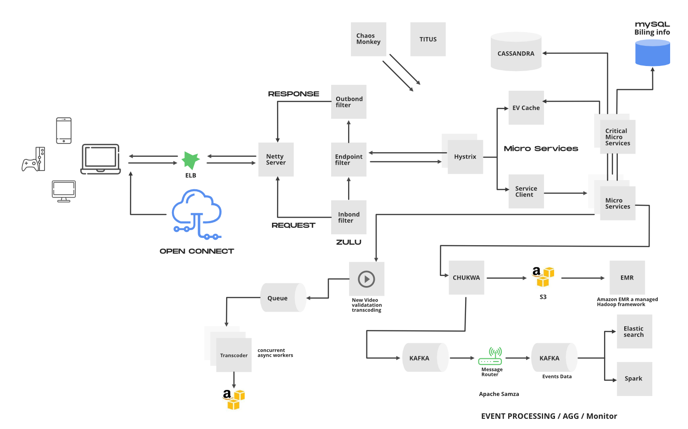
  <figcaption align="center">Fig 1: Architectural Vision Cmponent breakdown for Cinemana</figcaption>
</figure>

Cinemana works on two clouds: AWS and Open Connect. These two clouds work together as the backbone of Cinemana and both are highly responsible for providing the best video to the subscribers. 
The application has mainly 3 components: 
 <strong>Client:</strong> Device (User Interface) which is used to browse and play Cinemana videos. TV, XBOX, laptop or mobile phone, etc. 
 <strong>OC (Open connect) or Cinemana CDN:</strong> CDN is the network of distributed servers in different geographical locations, and Open Connect is Cinemana’s own custom global CDN (Content delivery network). It handles everything which involves video streaming. It is distributed in different locations and once you hit the play button the video stream from this component is displayed on your device. So if you’re trying to play the video sitting in North America, the video will be served from the nearest open connect (or server) instead of the original server (faster response from the nearest server). 
 <strong>Backend (Database):</strong> This part handles everything that doesn’t involve video streaming (before you hit the play button) such as onboarding new content, processing videos, distributing them to servers located in different parts of the world, and managing the network traffic. Most of the processes are taken care of by Amazon Web Services.
Cinemana frontend is written in ReactJS for mainly three reasons: startup speed, runtime performance, and modularity.

### 3.2 Stakeholders

| Stakeholders          | Definition                                                                                                                                                                                                                                                                |
| --------------------- | ------------------------------------------------------------------------------------------------------------------------------------------------------------------------------------------------------------------------------------------------------------------------- |
| Users (Customers)     | Users are the most important stakeholders in Cinemana's software architecture. They use the service to stream content and expect the software to be fast, reliable, and easy to use.                                                                                      |
| Software developers   | The software developers are responsible for building and maintaining the software that powers Cinemana. They need to ensure that the software is scalable, efficient, and easy to maintain.                                                                               |
| Operations team       | The operations team is responsible for ensuring that the software is running smoothly and that any issues are resolved quickly. They need to ensure that the software is highly available and that the customer experience is not impacted by any technical issues.       |
| Content providers     | Content providers are responsible for providing the content that is streamed on Cinemana. They need to ensure that their content is compatible with the software and that it is delivered in the best possible quality.                                                   |
| Business stakeholders | Business stakeholders include executives, investors, and partners who have a financial interest in the success of Cinemana's software architecture. They need to ensure that the software is delivering value to the customers and that it is profitable for the company. |
| Negative (hackers)    | Negative stakeholder is anyone who tries to use the system in an unethical way or harm the system and the users involved. This also includes users that download and then distribute the content of the system without permission.                                        |

### 3.3 Quality Attributes

There are several quality attributes that are important for Cinemana software architecture from a software architecture perspective. These include:

* Performance: Cinemana software architecture needs to be able to deliver a high-quality video streaming experience to customers with minimal buffering or lag time. This requires the software to be optimized for speed and efficiency.
* Scalability: The software architecture needs to be able to handle a large number of concurrent users and traffic spikes, particularly during popular events such as new releases or major sporting events.
* Reliability: The software architecture needs to be highly reliable, with minimal downtime or service disruptions. Customers expect to be able to access the service at any time, and any technical issues can lead to frustration and lost revenue.
* Security: The software architecture needs to be secure, with robust measures in place to protect customer data and prevent unauthorized access or hacking attempts.
* Maintainability: The software architecture needs to be easy to maintain, with clear documentation and well-organized code that can be easily updated or modified as needed.
* Usability: The software architecture needs to be easy to use, with intuitive interfaces and navigation that allow customers to quickly find and stream the content they are looking for.
* Compatibility: The software architecture needs to be compatible with a wide range of devices and platforms, from desktop computers to mobile devices. This requires the software to be designed to work seamlessly with a variety of hardware and software configurations.

### 3.4 Key Quality Concerns

| Key Quality concern | Concerned stakeholders | Viewpoints              |
| ------------------- | ---------------------- | ----------------------- |
| Security            | All                    | Layered          |
| Scalability         | Business stakeholders  | Deployment, Performance |
| Usability           | Users, developers      | Logical           |

### 1. Security:

   HTTPS — Encrypting the traffic between client and server over HTTPS. This will ensure that no one in the middle is able to see the data especially passwords.

   Authentication — Each API request post-log-in, will do authentication by checking the validity of auth_token in the authorization HTTP header. This ensures that the requests are legitimate.

   By analyzing the Cinemana system architecture using the layered pattern viewpoint, the security quality attribute can be addressed in a comprehensive and systematic way, ensuring that the system is secure at all levels of the architecture.
   Cinemana uses a layered security architecture with the following layers:

1. Presentation layer: This layer interacts with the end users. It consists of the Cinemana website and mobile apps. This layer implements HTTPS to encrypt all communication between the users and Cinemana servers. It also uses authentication mechanisms like passwords, OTPs, etc. to verify user identities.

2. Business layer: This layer contains the business logic and backend services of Cinemana. It exposes APIs to the presentation layer. These APIs are accessed over encrypted channels and also require authentication and authorization of the calling applications. This layer enforces security controls like rate limiting, input validation, etc. on the API requests. 

3. Persistence layer: This layer handles data storage and retrieval. The business layer communicates with this layer to store and fetch data. This communication also happens over encrypted channels and requires authentication. The persistence layer enforces access control and encryption on the stored data.

4. Database layer: This layer consists of the physical databases that store Cinemana data like user info, videos, etc. The persistence layer queries these databases. The databases themselves have security controls like authentication, access control, encryption, etc. to protect the data.

The key aspects of this security architecture are:

1. Encryption of all inter-layer communication using protocols like HTTPS.

2. Authentication and authorization at each layer to verify identities and enforce access control. 

3. Additional security controls like rate limiting, input validation, etc. at each layer.

4. Restricting direct access to lower layers from upper layers - all access happens through well-defined APIs.

5. Ensuring the security posture of each layer is robust and not dependent on any single layer. Each layer has its own controls, so security is applied in depth.
   By analyzing the Cinemana system architecture using the layered pattern viewpoint, the security quality attribute can be addressed in a comprehensive and systematic way, ensuring that the system is secure at all levels of the architecture.

### 2. Scalability

   - Horizontal Scaling — add more application servers behind the load balancer to increase the capacity o the service.
  <figure align="center"> 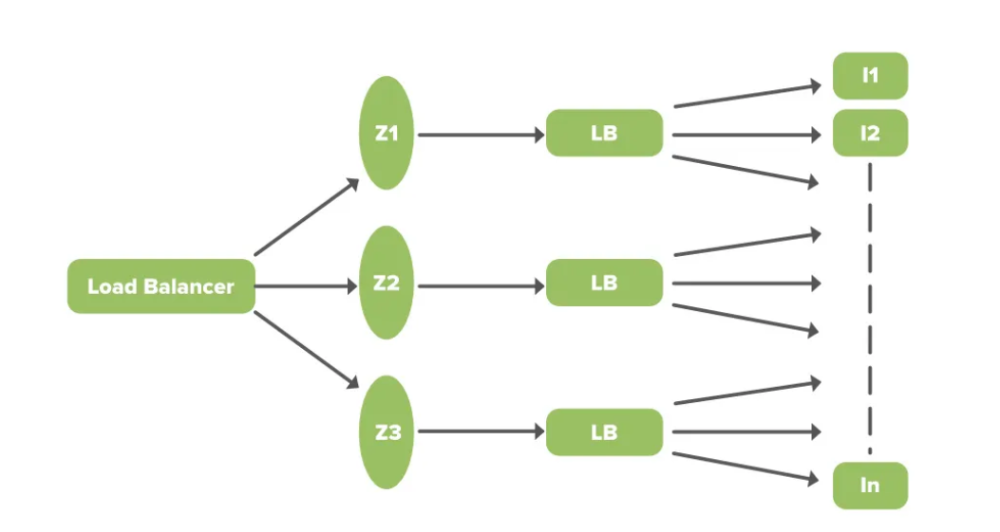
  <figcaption align="center">Fig 2: Load balancing</figcaption>
  </figure> 
  
   - Database replication — Use the relational database in Master-slave configuration where the write will happen to the master and reads from the slave. This will improve the performance of reading queries as they won’t be stopped due to write locks on rows. There is a slight replication lag (a few milliseconds) as data is written to the master DB and then propagated to the slave DB.
   - Database sharding — distributing data to multiple servers to perform read/write operations efficiently. we can share the video metadata database using video_id. Our hash function will map each video_id to a random server where we can store the video metadata.
   - Cache sharding — We can distribute our cache to multiple servers. Redis has out-of-box support for partitioning the data across multiple Redis instances. Using consistent Hashing for distributing data will ensure that load is equally distributed if one instance goes away.
   - Search database sharding — Elasticsearch comes with native support for sharding and replication. Sharding helps in improving the query runtime by running them in parallel against multiple shards.
### 3. Usability
  The user interface (of the web app).
   
  <figure align="center">
  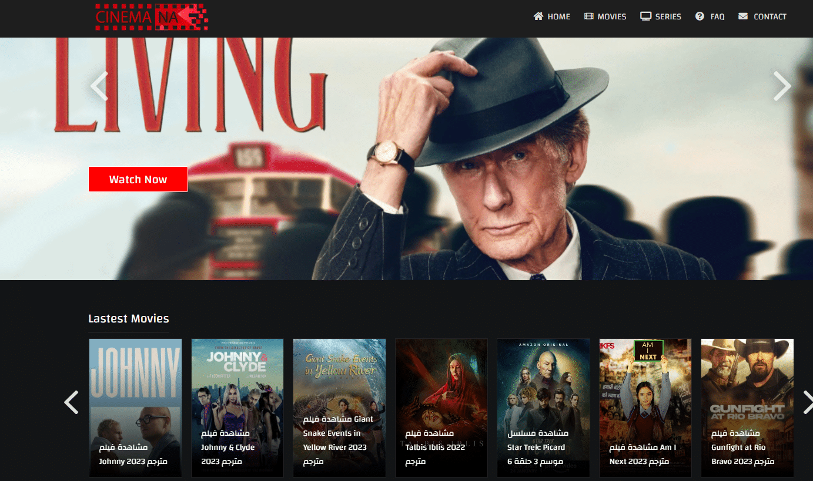
  <figcaption align="center">Fig 3: User Interface fot the web version of Cinemana</figcaption>
</figure> 
   
| Attribute | Description |
| --- | --- |
| Objective | Improve the user experience of the Cinemana platform by optimizing content recommendations. |
| Specific | Implement a more efficient and accurate recommendation system that increases user engagement and satisfaction by providing personalized content suggestions based on users' viewing history and preferences. |
| Measurable | Achieve a 10% increase in average user session duration and a 15% reduction in the number of users who cancel their subscription due to dissatisfaction with content recommendations within six months. |
| Achievable | Utilize advanced machine learning algorithms and collaborative filtering techniques to enhance the existing recommendation system, while also incorporating feedback from user surveys and A/B testing to iteratively refine the approach. |
| Relevant | Improving the usability and user experience of the platform is essential for retaining customers, increasing user satisfaction, and ensuring long-term success in the highly competitive streaming market. |
| Time-bound | Complete the implementation and launch of the improved recommendation system within six months. Measure and analyze the results for a further three months to gauge the effectiveness of the improvements and identify any necessary refinements. |

### 3.5 Stories and Use cases
<figure>
  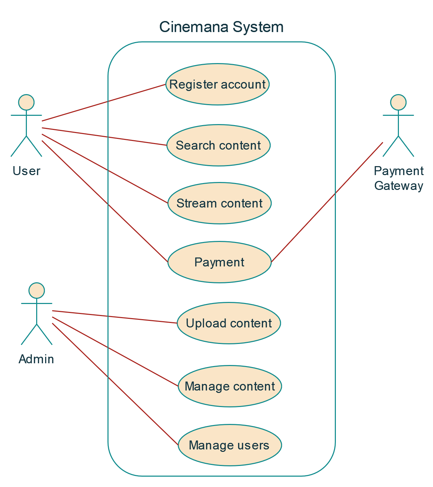
  <figcaption align="center">Fig 4: Use-case diagram</figcaption>
</figure>
 
<b>Scenario:</b> 
    So when talking about the use cases we can take a user who has a gold membership and wants to stream a movie on his phone as a scenario from both development and end-user viewpoints.
    <ol>
    <li>The user accesses the Cinemana application on their device and logs in to their account.
    <li>The application sends a request to the Cinemana server to retrieve the user's account information and subscription status.
    <li>The server verifies that the user has a gold membership subscription and sends back the corresponding meta-data.
    <li>The application retrieves a list of available movies and displays them to the user.
    <li>The user selects a movie to watch and clicks the "play" button.
    <li>The application sends a request to the Cinemana server to initiate the movie stream.
    <li>The server retrieves the movie data from its content delivery network (CDN) and starts streaming it to the user's device.
    <li>The application displays the movie on the user's screen and provides playback controls (e.g. pause, rewind, fast forward).
    <li>The user watches the movie and interacts with the playback controls as needed.
    <li>When the movie is finished, the application sends a request to the server to end the stream.
    <li>The server updates the user's viewing history and makes recommendations for future movies based on their viewing habits.
    </ol>

   ### Functionalities
  Cinemana offers a range of features for its users:

- **Account Management:** Users can create an account, log in, and delete their account as needed.

- **Subscription Plans:** Users can subscribe or unsubscribe to different plans based on their needs and preferences.

- **Multiple Accounts:** Cinemana allows users to have and handle multiple accounts as needed.

- **Video Streaming:** Users can watch videos on the platform.

- **Offline Viewing:** Users can download videos and watch them in offline mode.

- **Search and Discovery:** Users can search and discover videos through the video title.

- **Video Upload:** Cinemana developers can upload videos from the backend and show them on the platform.

- **Content Categorization:** The platform categorizes videos by trend, most popular, and by category to make it easy for users to choose.

- **Subtitles:** Users can select language subtitles so they can watch videos in any language.

- **Video Grouping:** Cinemana groups videos into TV series, drama series, and movie series, treating each video as an independent entity.

- **Analytics and Recommendations:** The platform provides user suggestions or recommendations for similar videos based on the user's behavior.

- **Multiple Device Synchronization:** Users can synchronize different devices under the same account, allowing them to continue watching the same episode without replay.

- **24/7 Playback:** Videos can be played back 24/7.

- **Fallback:** The platform provides a fallback option in case of playback issues or errors.

<figure align="center">
  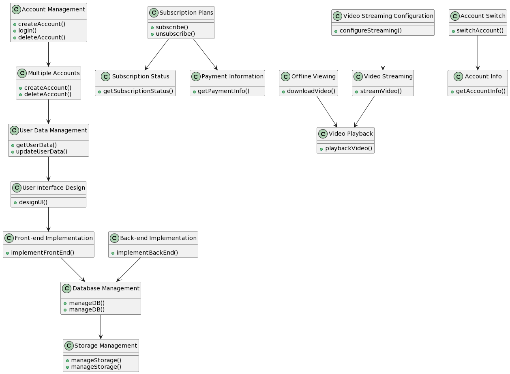
  <figcaption align="center">Fig 5: Logical viewpoint of the functional requirements</figcaption>
</figure>
 

### 3.6 Process diagram
<figure align="center">
  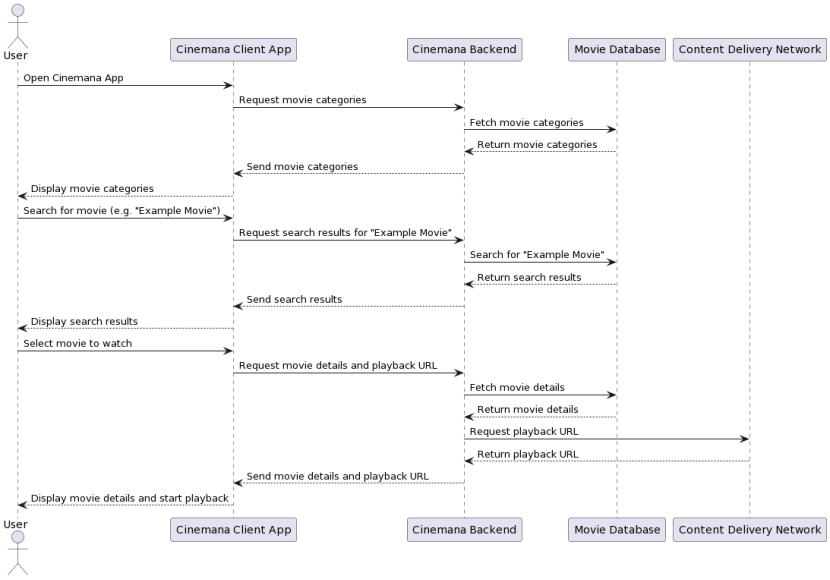
  <figcaption align="center">Fig 6: Process Diagram</figcaption>
</figure> 

## 4. Database and Cloud
  Cinemana uses two different databases i.e. MySQL(RDBMS) and Cassandra(NoSQL) for different purposes.  
 EC2 Deployed MySQL 
Cinemana saves data like billing information, user information, and transaction information in MySQL because it needs ACID compliance. Cinemana has a master-master setup for MySQL and it is deployed on Amazon large EC2 instances using InnoDB. 

 The setup follows the “Synchronous replication protocol” where if the writer happens to be the primary master node then it will be also replicated to another master node. The acknowledgment will be sent only if both the primary and remote master nodes’ write have been confirmed. This ensures the high availability of data. 
<figure>
  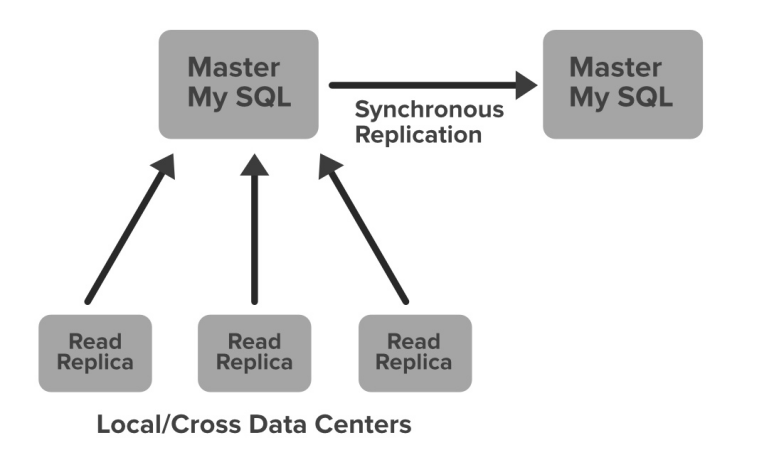
  <figcaption align="center">Fig 7: Synchronous replication protocol</figcaption>
</figure> 
Cinemana has set up the read replica for each and every node (local, as well as cross-region). This ensures high availability and scalability.
   
   ### 4.1 Database Schema
  <figure align="center">
  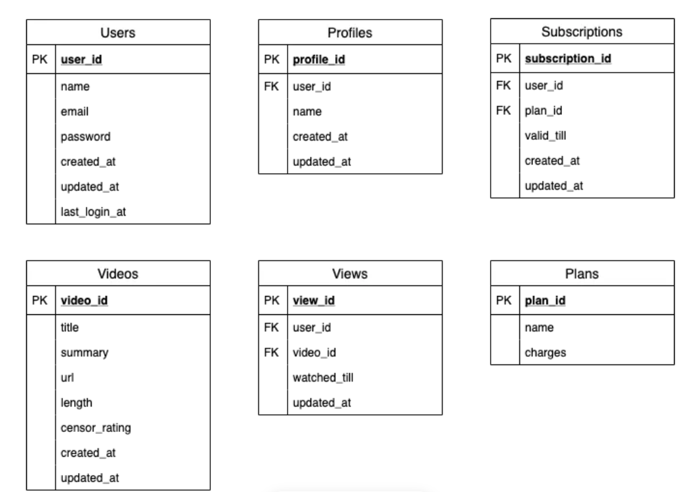
  <figcaption align="center">Fig 8: Database Schema</figcaption>
  </figure>

   ### 4.2 Database Pipelines
  <figure align="center">
  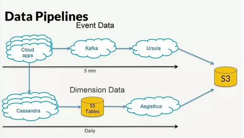
  <figcaption align="center">Fig 9: Database Pipelines</figcaption>
</figure>
 
   ### 4.4 Cloud Architecture
   Netflix cloud architecture is a highly available, scalable, and fault-tolerant system that operates on Amazon Web Services (AWS) using a microservices-based approach. It is designed to handle millions of requests per second and uses a variety of technologies such as Apache Cassandra, Apache Kafka, and Amazon Simple Storage Service (S3) to store and process massive amounts of data. The architecture includes several layers, including edge services, mid-tier services, and backend services, each with its own unique function and set of technologies. Netflix also employs chaos engineering practices to test and improve its system's resiliency to failures.

## 5. Analysis

  ### 5.1 Assumptions

1. Total number of daily active users = 100 million
2. The peak daily active users, 100 million * 3 = 300 million
3. The max peak daily active users in 3 months, 300 million * 2 = 600 million
4. The average number of videos watched by each user per day = 5
5. The average size of one video = 500 MB
6. The average number of videos uploaded per day from the backend = 1,000
7. Total number of videos watched per day = 100 million * 5 = 500 million
8. Total peak video per day = 1.5 billion
9. Total max peak video per day = 3 billion
10. Total egress per day = 500 million * 500 MB = 250 PB (Peta Byte)
11. Egress bandwidth = 29.1GB/sec
12. Total ingress for upload = 1,000 * 500MB = 500GB
13. Ingress bandwidth = 5.8MB/sec
14. Total Storage required in 5 years = 500 GB * 5 * 365 = 912.5TB (Please note that Cinemana creates multiple formats and resolutions for each video optimized for different device types. So the storage will be more than 912.5TB.)
  
<figure>
  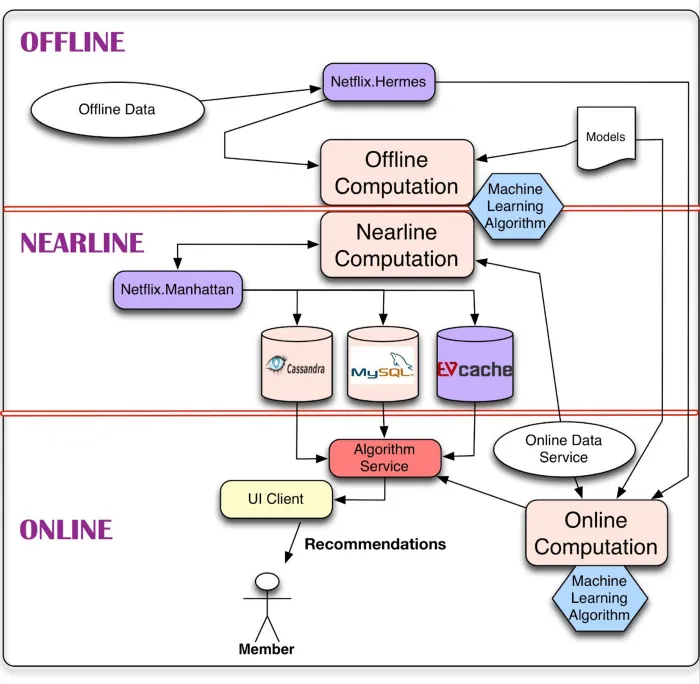
  <figcaption align="center">Fig 10: Capacity Estimation</figcaption>
</figure>

  ### 5.2 Key Business Metrics
  <figure align="center">
  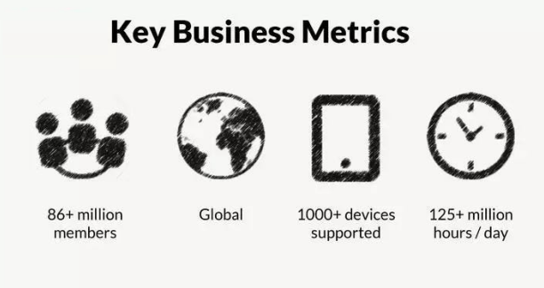
  <figcaption align="center">Fig 11: Key Business Metrics</figcaption>
</figure>

  ### 5.3 High-level Design Decisions

<Strong> High level Design Decision 1: To ensure fault tolerance in the Cinemana architecture</strong>
 

  | Name | Fault tolerance |
| --- | --- |
| Decision | 1 |
| Status | Approved |
| Problem/Issue | Without fault tolerance, Cinemana would not be able to provide the highly available and resilient service. |
| Decision | To handle issues around scale, distributed systems, single points of failure, software/hardware errors and transient issues while still ensuring high availability, fault tolerance is a core requirement for the Cinemana architecture. |
| Arguments | The architecture is designed to handle failures gracefully. With a microservice architecture, individual service failures do not bring down the entire system. Other mechanisms like circuit breakers, fallback, retry, timeout etc. provide fault tolerance. |
| Design Decision | To ensure fault tolerance in the Cinemana architecture |
| Alternatives | - Redundancy and replication - Load balancing - Disaster recovery and backup - Graceful degradation - Failover and self-healing - Monitoring and alerting |
| Implications | - Increases system availability and resilience - Reduces the likelihood of service disruptions and downtime - Enables the system to handle unexpected failures and errors gracefully - Provides a better user experience and customer satisfaction |
| Possible Negative Impact on Quality | - Over-provisioning redundancy and replication may increase costs and complexity - Improper load balancing may cause uneven resource allocation and impact system performance - Inadequate disaster recovery and backup may result in data loss and service disruption - Poorly designed graceful degradation may result in degraded service quality and user frustration - Failover and self-healing mechanisms may cause service disruptions if not implemented properly - Excessive monitoring and alerting may result in information overload and distract from critical issues|

 <Strong> High level Design Decision 2: To address the fallout problem in the streaming service</strong>
 

| Name | Fallout |
| --- | --- |
| Decision | 2 |
| Status | Approved |
| Problem/Issue | The "fallout" problem is a term used to describe the situation where a user starts to watch a movie or TV show on Cinemana but then abandons it before finishing. This can be a problem for Cinemana because it can lead to a lower engagement rate and potentially impact the user's satisfaction with the service. |
| Decision | To address the fallout problem, Cinemana has developed various strategies, such as personalized recommendations, auto-play next episode, and pre-loading content to reduce buffering time. Cinemana also uses data analytics to analyze user behavior, including when and why users stop watching a particular show or movie. This data is then used to make recommendations and improve the overall user experience. |
| Arguments | Overall, the fallout problem is a challenge for any streaming service, as users have a vast choice of content and can easily switch to other options. By continually improving its algorithms and 
| Design Decision | To address the fallout problem in the streaming service |
| Alternatives | - Personalized recommendations - Auto-play next episode - Pre-loading content to reduce buffering time |
| Implications | - Improves engagement rate - Enhances user experience - Reduces the likelihood of user churn - Enables the service to gather valuable data on user behavior |
| Possible Negative Impact on Quality | - Over-reliance on algorithmic recommendations may limit user choice and serendipity - Auto-play next episode may encourage binge-watching, which can have negative health effects - Pre-loading content may impact data usage and device storage capacity - Inaccurate recommendations may result in frustration and dissatisfaction with the service - Overloading the user interface with too many recommendations may overwhelm users |
| Feature solution graph|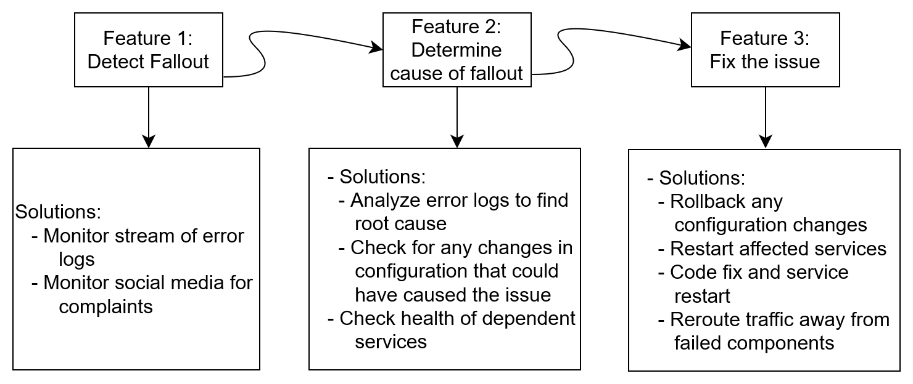|

# References
<ol>
<li> System Architecture: Home Power Save, University of Groningen, Faculty of Mathematics and Natural Sciences, Department of Computing Science, Software Architecture
<li> Ten years on: How Netflix completed a historic cloud migration with AWS. By Tom Macaulay on Computerworld. Sep 10, 2018.
<li> Performance Vs Scalability. By Beekums. Aug 19, 2017.
<li> Len Bass, Paul Clements, Rick Kazman. Software Architecture in Practice Third Edition
<li> Automating Operations of a Global CDN. By Robert Fernandes at Strange Loop. Sep 14, 2019.
<li> 软件体系结构描述 slides.
</ol>
