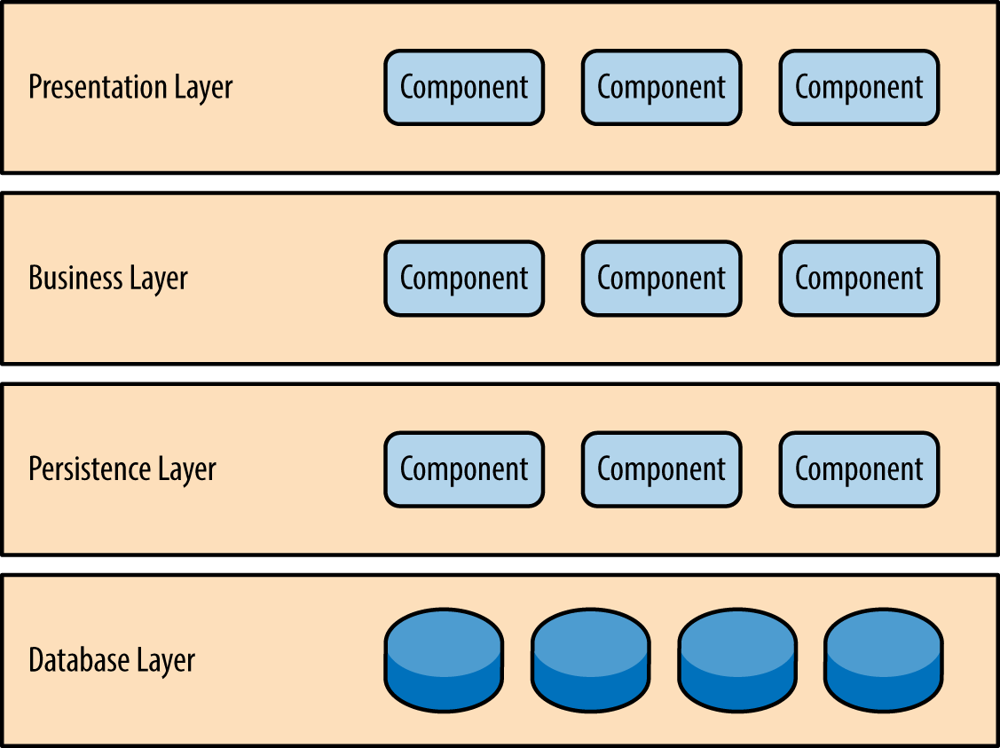

<h1 style: align=center> Cinemana: System Architecture </h1>

 Modern Software Architecture 

Al Hassani Baraa Basim Raoof 2022272110002   Kazi Enamul Hque 2022272110004     Pant Sushovan Nath 2022272110006   Muhammad Zarar 2022272110007  

---

| Date       | Member   | Contribution             |
| ---------- | -------- | ------------------------ |
| 30/03/2023 | Sushovan | Initial comit to github. |
| 03/04/2023 | All | Updated the key quality attributes. |
| 06/04/2023 | Sushovan, Baara, Kazi | Finished three quality attributes. |

---

## Contents

- [Description](#description)
- [Stakeholders](#stakeholders)
- [Quality Attributes](#quality-attributes)
- [Key Quality Concerns](#key-quality-concerns)
- 

## Description

Cinemana is a subscription-based streaming service that allows its members to watch TV shows and movies on an internet-connected device. Cinemana allows its users to easily navigate through a number of movies and TV shows effortlessly and also provides a search bar functionality. Users will be able to stream the content online or download it directly to the device. It is equipped with user-tailored recommendation system which is backed by a large database of movies. It is available in different languages and also provides its users with the flexibility to synchronize different devices under the same account. It also allows the users to add movies to a “watch-later” list and also group movies together.

## Stakeholders

| Stakeholders          | Definition                                                                                                                                                                                                                                                                |
| --------------------- | ------------------------------------------------------------------------------------------------------------------------------------------------------------------------------------------------------------------------------------------------------------------------- |
| Users (Customers)     | Users are the most important stakeholders in Cinemana's software architecture. They use the service to stream content and expect the software to be fast, reliable, and easy to use.                                                                                      |
| Software developers   | The software developers are responsible for building and maintaining the software that powers Cinemana. They need to ensure that the software is scalable, efficient, and easy to maintain.                                                                               |
| Operations team       | The operations team is responsible for ensuring that the software is running smoothly and that any issues are resolved quickly. They need to ensure that the software is highly available and that the customer experience is not impacted by any technical issues.       |
| Content providers     | Content providers are responsible for providing the content that is streamed on Cinemana. They need to ensure that their content is compatible with the software and that it is delivered in the best possible quality.                                                   |
| Business stakeholders | Business stakeholders include executives, investors, and partners who have a financial interest in the success of Cinemana's software architecture. They need to ensure that the software is delivering value to the customers and that it is profitable for the company. |
| Negative (hackers)    | Negative stakeholder is anyone who tries to use the system in an unethical way or harm the system and the users involved. This also includes users that download and then distribute the content of the system without permission.                                        |

## Quality Attributes

There are several quality attributes that are important for Cinemana software architecture from a software architecture perspective. These include:

* Performance: Cinemana software architecture needs to be able to deliver a high-quality video streaming experience to customers with minimal buffering or lag time. This requires the software to be optimized for speed and efficiency.
* Scalability: The software architecture needs to be able to handle a large number of concurrent users and traffic spikes, particularly during popular events such as new releases or major sporting events.
* Reliability: The software architecture needs to be highly reliable, with minimal downtime or service disruptions. Customers expect to be able to access the service at any time, and any technical issues can lead to frustration and lost revenue.
* Security: The software architecture needs to be secure, with robust measures in place to protect customer data and prevent unauthorized access or hacking attempts.
* Maintainability: The software architecture needs to be easy to maintain, with clear documentation and well-organized code that can be easily updated or modified as needed.
* Usability: The software architecture needs to be easy to use, with intuitive interfaces and navigation that allow customers to quickly find and stream the content they are looking for.
* Compatibility: The software architecture needs to be compatible with a wide range of devices and platforms, from desktop computers to mobile devices. This requires the software to be designed to work seamlessly with a variety of hardware and software configurations.

## Key Quality Concerns

| Key Quality concern | Concerned stakeholders | Viewpoints              |
| ------------------- | ---------------------- | ----------------------- |
| Security            | All                    | Layered pattern         |
| Scalability         | Business stakeholders  | Deployment, Performance |
| Usability           | Users, developers      | Functionality           |
|                     |                        |                         |

1. Security:

   HTTPS — Encrypting the traffic between client and server over HTTPS. This will ensure that no one in the middle is able to see the data especially passwords.

   Authentication — Each API request post-log-in, will do authentication by checking the validity of auth_token in the authorization HTTP header. This ensures that the requests are legitimate.

   By analyzing the Cinemana system architecture using the layered pattern viewpoint, the security quality attribute can be addressed in a comprehensive and systematic way, ensuring that the system is secure at all levels of the architecture.
   
   By analyzing the Cinemana system architecture using the layered pattern viewpoint, the security quality attribute can be addressed in a comprehensive and systematic way, ensuring that the system is secure at all levels of the architecture.

   2. Scalability

   - Horizontal Scaling — add more application servers behind the load balancer to increase the capacity o the service.
   - Database replication — Use the relational database in Master-slave configuration where the write will happen to the master and reads from the slave. This will improve the performance of reading queries as they won’t be stopped due to write locks on rows. There is a slight replication lag (a few milliseconds) as data is written to the master DB and then propagated to the slave DB.
   - Database sharding — distributing data to multiple servers to perform read/write operations efficiently. we can share the video metadata database using video_id. our hash function will map each video_id to a random server where we can store the video metadata.
   - Cache sharding — We can distribute our cache to multiple servers. Redis has out-of-box support for partitioning the data across multiple Redis instances. Using consistent Hashing for distributing data will ensure that load is equally distributed if one instance goes away.
   - Search database sharding — Elasticsearch comes with native support for sharding and replication. Sharding helps in improving the query runtime by running them in parallel against multiple shards.
2. Usability
   The user interface (of the web app).
   

   TODO - Use use case diagrams to introduce functional reuirements. Use scenarios to play out some of the use cases.
